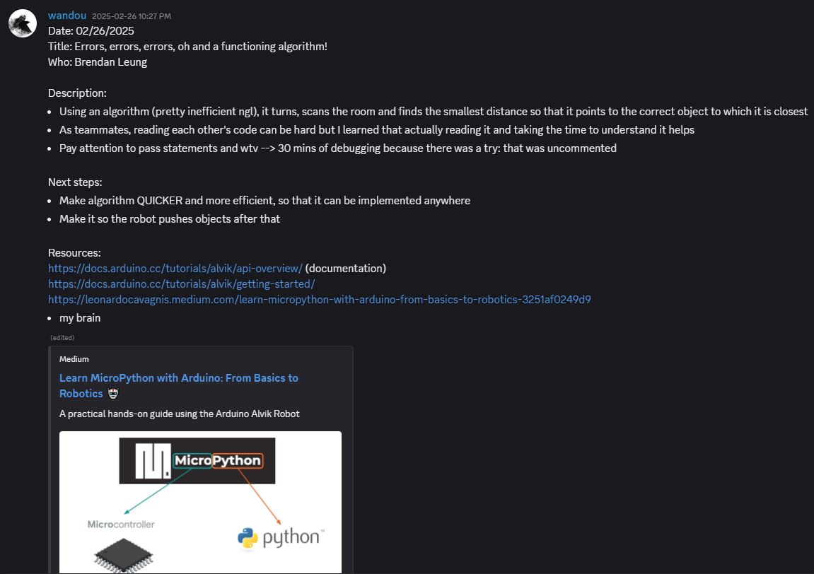

# Arduino Alvik: Developing a Project in Engineering Robotics from Scratch!
## By Brendan Lok Hin Leung (2337093), Comprehensive Examination (990-200-B0), Dawson College
### Introduction
<p>&nbsp;&nbsp;&nbsp;&nbsp;Independent learning is something that I have struggled with. How do I build a project from scratch? How do I acquire the skills I need to conceive a project I am interested in? Along with my continued interest for computers, programming and engineering, I aimed to learn the art of learning by exploring engineering robotics as a beginner and documenting my journey so that future beginners can see how my teammate and I modeled a path to learning how to develop a project from nothing. I wished to be able to learn on the fly, adapt and conceive a project that involves hardware and software from start to finish. With my project, I was able to get hands-on with robots and software to realize this goal and gain the experience and technical skills I need to create a project from nothing.</p>
<p>&nbsp;&nbsp;&nbsp;&nbsp;My goal was achieved using the Arduino Alvik robot, a premade robot made by Arduino, an open-source hardware company known for their electronics. With this robot and, along with my teammate, Semih Eski, we built a robot capable of picking up coloured ping pong balls from a line following track using a Raspberry Pi, a Linux-based computer used in various electronics projects, to identify the colours of the ping pong balls using a camera. My teammate also designed a custom-made robotic arm for the Alvik, which was integrated with its hardware to help pick up the balls off the ground. </p>

### Project Description
<ul>
<li><b>Objective</b></li>
<p>&nbsp;&nbsp;&nbsp;&nbsp; The goal of my project was to discover a learning path for engineering robotics. I focused on acquiring the experience I needed to develop a project in a field I had and still have a fond interest in, as well as the necessary skills I need to use software and hardware to develop a project. </p>
<li><b>Inspiration</b></li>
<p>&nbsp;&nbsp;&nbsp;&nbsp; When I was young, I became fondly interested in computers and electronics, but I never knew where to start. I was fascinated at how people were able to make these cool gadgets, but I struggled to put my hands on it. I struggled to program. I struggled to build. But I never struggled to dream that I could program and build things on my own. I knew I had to start somewhere. I knew I had to learn by doing something. So, I chose to design a project with the Arduino Alvik robot, a premade robot conceived by Arduino, an open-source hardware company known for their microcontrollers and other electronics. </p>
<p>&nbsp;&nbsp;&nbsp;&nbsp; While I could have built a robot from scratch, I decided to use the Alvik because it helped me gain a solid foundation for how hardware and software interact with each other without having to think about wiring and connections. For example, I learned along the way that the communication between hardware and software has to be exact. I realized that the way I think the robot would behave with the code I implemented sometimes did not work out in practice. Additionally, my teammate and I wished to extend the already existing capabilities of the Alvik and learn how different technologies could be implemented with each other. Needless to say, we were ambitious. I used a Raspberry Pi, a Linux-based computer, to help with serial communication between a robotic arm designed by my teammate from scratch and the Alvik, so that the Alvik is able to recognize coloured ping pong balls and pick them off the ground using its robotic arm. </p>
<p>&nbsp;&nbsp;&nbsp;&nbsp;My inspiration largely came from experimenting at the beginning of our project with the robot with my teammate and the project was better understood after learning what my teammate and I were capable of.</p>
<li><b>Design and Planning</b></li>
<p>&nbsp;&nbsp;&nbsp;&nbsp; At the beginning of my project, I was not fully sure what to do. I wanted to develop a project using artificial intelligence to make the Alvik drive around autonomously, but soon enough this turned out unfeasible in the time I had. However, I was determined to keep the essence of that idea inside of my project. After much brainstorming, my teammate and I made our idea much more feasible, incorporating line following features to imitate this autonomous navigation. As described in my journals early on, I began first exploring different functionalities of the robot. Figure 1 below shows me playing around with the robot, attempting to make the Alvik find the object it is closest to.</p>
<figure>
    
    <figcaption><em>Figure 1. My history of what I did was written in Discord. In a journal three months ago, I tried making the robot point towards the object it was closest to. It seems like it was successful, but it was quite slow!</em></figcaption>
</figure>
<p>&nbsp;&nbsp;&nbsp;&nbsp;These days helped both my teammate and I become familiar with the robot and its capabilities. At the time, we thought of making a robot that could push objects off the table; of course, without making the Alvik fall off the table itself! Because our program was quite straightforward, we wanted to make something more elaborate. </p>
<p>&nbsp;&nbsp;&nbsp;&nbsp;My teammate and I interviewed a Masters student from the University of Toronto specializing in robotics and AI to help guide us in our project. My ambition was soon met with realistic expectations, as she told us that AI would be quite difficult and we should only implement it if we had time. Then, she told us that we should divide our project into little chunks, tackling each small problem progressively and combining them together later. This strategy helped me in the project development because, as a beginner, I was quite overwhelmed with the amount of features I had to consider. Instead, breaking the project up into smaller, more manageable pieces made the project seem more achievable. This is how Semih and I tackled different parts of the project. </p>
<p>&nbsp;&nbsp;&nbsp;&nbsp;This idea had major implications on how my teammate and I worked on our project because we knew we had a learning path. We had a roadmap. We knew we wanted to make a robot capable of driving itself around and have some image recognition capabilities. With that, in the months following, we focused on developing Alvik’s functions: line following, object detection, colour detection and etc. My teammate, meanwhile, focused on creating the robotic arm and integrating it with our robot. In our final stage, together, we implemented all these smaller chunks together in what will be a robot which is capable of line following and picking up coloured ping pong balls in its vicinity.</p>
</ul>

### Implementation
<ul>
<li><b>Hardware Setup</b></li>
<ul>
<li>Components Used</li>
<ul>
<li>Arduino Alvik</li>
<li>Raspberry Pi 3 Model B+</li>
<li>Raspberry Pi Camera Module 1</li>
<li>3D Printed Robotic Arm</li>
<li>Six SG90 Positional Servos</li>
<li>PCA9685 Servo Driver</li>
<li>Power Supplies</li>
</ul>
</ul>

<li><b>Software Development</b></li>
<ul>
<li>Libraries Used</li>
<ul>
<li>Arduino Alvik Library</li>
<li>Serial Library</li>
<li>OpenCV</li>
<li>OS</li>
<li>NumPy</li>
<li>imutils</li>
</ul>
</ul>
<p>&nbsp;&nbsp;&nbsp;&nbsp; The code specific to the Alvik was developed using the Arduino IDE, while the code for the Raspberry Pi was written on the Pi's text editor. All of Alvik's functions can be found on <a href = "https://docs.arduino.cc/tutorials/alvik/api-overview/">Alvik's API</a>, which provides all the details of each method. It is important to note that while Arduino claims that all functions work between MicroPython and C++, we encountered runtime errors where the C++ compiler was unable to locate a function like alvik.drive(). We used Alvik's API extensively in our project, making this a valuable site for learning how to make the Alvik move, how to use its sensors, etc. We also used Arduino's own courses, found <a href = "https://www.arduino.cc/education/courses">here</a>, which helped us learn early on how to make Alvik follow a line and detect objects in front of it. It is a fantastic way to familiarize yourself with all that Alvik offers out-of-the-box before trying out more ambitious ideas. </p>
<p>&nbsp;&nbsp;&nbsp;&nbsp; To detect the ping pong balls, we used OpenCV, a library used for real-time computer vision, which runs locally on the Raspberry Pi and then sends the information back to the Alvik using serial communication. The code below, inspired by <a href="https://github.com/freedomwebtech/colortracking/blob/main/test.py">this GitHub repository</a>, allows us to identify orange coloured ping pong balls. We initially wished to deploy a machine learning model to identify our ping pong balls; however, it was hard to deploy because of compatibility issues between Windows and Raspberry Pi. So, we elected to detect colours instead because it was compatible and, more importantly, lightweight to run on the Raspberry Pi. Still, OpenCV provides us with a powerful computer vision library that suits our needs. NumPy was used extensively to store HSV values, while OS provided us with an easier way to manage file directories.</p>

```py
# Import OpenCV and NumPy Libraries
import cv2
import numpy as np

# Initialize camera
cap = cv2.VideoCapture(0)
cap.set(cv2.CAP_PROP_FRAME_WIDTH,  640)
cap.set(cv2.CAP_PROP_FRAME_HEIGHT, 480)

# Upper and Lower Bounds for the color to be identified (in HSV NOT RGB)
ORANGE_LOWER = np.array([ 6, 120, 160]) # Set these values depending on your specific lighting conditions and what color you would like to identify
ORANGE_UPPER = np.array([26, 255, 255])

kernel = np.ones((5, 5), np.uint8)   # this is used for morphology

while True:
    success, frame = cap.read()

    # If fails to read camera data
    if not success:
        print("Camera read failed — exiting.")
        break

    # Color spectrum used
    hsv = cv2.cvtColor(frame, cv2.COLOR_BGR2HSV)

    # Color mask
    orange_mask = cv2.inRange(hsv, ORANGE_LOWER, ORANGE_UPPER)
    mask = orange_mask

    mask = cv2.morphologyEx(mask, cv2.MORPH_OPEN,  kernel, iterations=1)
    mask = cv2.morphologyEx(mask, cv2.MORPH_CLOSE, kernel, iterations=1)

    contours, _ = cv2.findContours(mask, cv2.RETR_EXTERNAL, cv2.CHAIN_APPROX_SIMPLE)
    
    # If it detects an orange mask
    if contours:
        c = max(contours, key=cv2.contourArea)
        if cv2.contourArea(c) > 300:        # Ensures that tiny specs are not identified
            
            # Locates the position of the color to be identified
            (x, y), radius = cv2.minEnclosingCircle(c)
            centre = (int(x), int(y)); radius = int(radius)

            cv2.circle(frame, centre, radius, (0, 255,   0), 2)
            cv2.circle(frame, centre,   3,    (0,   0, 255), -1)
            cv2.putText(frame, "orange ball",
                        (centre[0] - 40, centre[1] - radius - 10),
                        cv2.FONT_HERSHEY_SIMPLEX, 0.6, (255, 255, 255), 2)

    cv2.imshow("Mask (debug)", mask)
    cv2.imshow("Ball contour", frame)

    if cv2.waitKey(1) & 0xFF == ord('q'):
        break

cap.release()
cv2.destroyAllWindows()
```
<p>&nbsp;&nbsp;&nbsp;&nbsp; The success rate of this piece of software heavily depends on the lighting conditions in which we were in. We struggled mostly to land consistent results, given that the lighting conditions in which we found ourselves when testing our software were always different. We always had to constantly tweak the lower and upper bounds for colour so that the orange ball is detected in each specific lighting conditions in which we were in. Not only did the orange ball have to be detected, but it also had to enclose the orange ball entirely and accurately pinpoint its center. This is because this was used to calculate the distance between the Alvik and the ping pong in front of it, using the code below, which was developed with the help of <a href = "https://pyimagesearch.com/2015/01/19/find-distance-camera-objectmarker-using-python-opencv/?utm_source=chatgpt.com">this website</a>. </p>

```py
# Import the necessary packages
from imutils import paths
import numpy as np
import imutils
import cv2
import os

  
KERNEL = np.ones((5, 5), np.uint8)       

# These bounds are exactly like the code for the ball color detection alone
ORANGE_LOWER = np.array([4,140,58])
ORANGE_UPPER = np.array([12,214,129])     

# This takes the code from the ball color detection in order to create a circle around the ping pong ball
def find_marker(image):
    hsv = cv2.cvtColor(image, cv2.COLOR_BGR2HSV)
    mask = cv2.inRange(hsv, ORANGE_LOWER, ORANGE_UPPER)

    mask = cv2.morphologyEx(mask, cv2.MORPH_OPEN, KERNEL, iterations=1)
    mask = cv2.morphologyEx(mask, cv2.MORPH_CLOSE, KERNEL, iterations=1)

    cnts = cv2.findContours(mask, cv2.RETR_EXTERNAL, cv2.CHAIN_APPROX_SIMPLE)
    cnts = imutils.grab_contours(cnts)
    if not cnts:
        return None
    c = max(cnts, key=cv2.contourArea)
    if cv2.contourArea(c) < 200:
        return None
    (x, y), radius = cv2.minEnclosingCircle(c)
    return (x, y), radius

# Calculates the distance from camera
def distance_to_camera(knownWidth_cm, focalLength_px, perWidth_px):
    return (knownWidth_cm * focalLength_px) / perWidth_px

# Below, insert the path to the photo that is required to calibrate the distance calculations
calib_path = "path of calibration photo goes here"

# Need to put the known distance of the ping pong ball from the camera from the calibration photo
KNOWN_DISTANCE_CM = 33.50 # Distance of object from camera
KNOWN_WIDTH_CM    = 4.0 # Width of object 

# Raises an error if no calibration photo exists
if not os.path.isfile(calib_path):
    raise FileNotFoundError(f"calibration image missing")

# Reads the image
calib_image = cv2.imread(calib_path)
# Before taking the photo, ensure that the camera actually detects and puts a perfect circle around the ping pong ball
res = find_marker(calib_image)
# Raises an error if the ball detection software does not detect the ball. This is why you must ensure the ball is detected prior to taking the photo.
if res is None:
    raise RuntimeError("No ball found")
(center0, radius0) = res
perWidth0 = 2 * radius0 
focalLength_px = (perWidth0 * KNOWN_DISTANCE_CM) / KNOWN_WIDTH_CM

cv2.namedWindow("image", cv2.WINDOW_NORMAL)
cv2.resizeWindow("image", 800, 600)

# Code checks for photos in a certain directory of which you have stored photos of distances of ping pong balls you wish to calculate
for imagePath in sorted(paths.list_images("path of photo goes here")): # Once there is a calibration photo, indicate where your photos are taken
    # Path of image
    image = cv2.imread(imagePath)

    # Finds ball in image
    res = find_marker(image)

    # If no ball is found, nothing is returned
    if res is None:
        dist_cm = None
    else: # Otherwise, it calculates the position and distance of the ball from the image itself
        (x, y), radius = res
        perWidth = 2 * radius
        # Calculates the distance from the camera
        dist_cm = distance_to_camera(KNOWN_WIDTH_CM, focalLength_px, perWidth)

        center = (int(x), int(y))
        cv2.circle(image, center, int(radius), (0, 255, 0), 2)
        cv2.circle(image, center, 3, (0, 0, 255), -1)

    # Displays the distance if the photo has a ping pong ball detected
    if dist_cm is not None:
        cv2.putText(
            image,
            f"{dist_cm:.1f} cm",
            (10, image.shape[0] - 10),
            cv2.FONT_HERSHEY_SIMPLEX,
            1.0,
            (0, 255, 0),
            2
        )
    # Displays image
    cv2.imshow("image", image)
    key = cv2.waitKey(0) & 0xFF
    if key == ord('q'):
        break

cv2.destroyAllWindows()
```
<p>&nbsp;&nbsp;&nbsp;&nbsp; With this strategy, a major downside we encountered is that we needed to take a calibration photo every time the ping pong balls found themselves in new lighting situations, since the colours were always different. Had we used an image detection model, this would not be necessary. Also, we had to always ensure that the whole ping pong ball was enclosed by the model. Otherwise, it would deliver inaccurate results. This was a major milestone in our project because this was required to tell the Alvik how far the ping pong ball is positioned and enable it to travel that distance. For that, we used serial communication between the Alvik and the Raspberry Pi. </p>
<p>&nbsp;&nbsp;&nbsp;&nbsp; We found that establishing serial communication via Universal Serial Bus (USB) between the Alvik and the Raspberry Pi was quite straightforward.  We used C++ because of its serial capabilities, which we were not able to deploy with MicroPython on Alvik's end. Obviously, both the Alvik and Raspberry Pi must be connected via USB to communicate with each other. Here is the code from Alvik's end: </p>

```arduino
// Conta
#include "Arduino_Alvik.h"
Arduino_Alvik alvik;
String readString;

void setup() {
  // In the setup, it is important to initialize Serial to receive and send serial messages
  Serial.begin(115200);
  while(!Serial){
    ; // wait for USB serial to come out
  }
  alvik.begin();
  alvik.left_led.set_color(0,0,1);
  alvik.right_led.set_color(0,0,1);

  while(!alvik.get_touch_ok()){
    delay(50);
  }
}

void loop() {
  while (!alvik.get_touch_cancel()){

    alvik.set_illuminator(false); // turns off the illuminator below the Alvik for the duration of the program
    alvik.get_line_sensors(line_sensors[0], line_sensors[1], line_sensors[2]); // returns IR data to the list line_sensors
    alvik.get_color_raw(rgb_colors[0],rgb_colors[1],rgb_colors[2]); // returns RGB values into the list rgb_colors
    error = calculate_center(line_sensors[0], line_sensors[1], line_sensors[2]); // calculates deviation from the line
    control = error * kp; # the amount of adjustment Alvik needs to stay on course (on the line)
    // For Serial Monitoring: prints the RGB colours the Alvik sees with its colours sensors
    Serial.print(rgb_colors[0]);
    Serial.print("\t");
    Serial.print(rgb_colors[1]);
    Serial.print("\t");
    Serial.print(rgb_colors[2]);
    Serial.print("\n");

    // Once the Alvik detects a white gap in the line, it stops to check for the ping pong ball around it
    if ((rgb_colors[0] == 5 || rgb_colors[0] == 4) && (rgb_colors[1] == 4) && (rgb_colors[2] == 4)){ // If the triple (R,G,B) is any of these values, strong indication that white is below the Alvik (depends on the white)
      // Alvik moves forward to a position where it will not redetect the white line a second time
      alvik.left_led.set_color(1,0,0); 
      alvik.right_led.set_color(1,0,0);
      alvik.brake();
      delay(2000);
      alvik.rotate(12);
      delay(2000);
      alvik.set_wheels_speed(10,10);
      delay(2000);
      alvik.brake();
      delay(3000);

      // Alvik sends a message to 
      Serial.println("photo");

      while(Serial.available() <= 0){
        alvik.brake();
      } 
      while(Serial.available()){
        delay(3);
        if (Serial.available() > 0 ){
          char c = Serial.read();
          readString += c;
        }
      }
      int distance = readString.toInt();
      int time = 5; // seconds
      float diameter = 3.4;
      float rpm = 60*distance/(3.14159*diameter*time);
      alvik.set_wheels_speed(rpm,rpm);
      delay(time*1000);
      
    
    }

    
    if (control > 0.2){
      alvik.left_led.set_color(1,0,0);
      alvik.right_led.set_color(0,0,0);
    }
    else{
      if (control < -0.2){
        alvik.left_led.set_color(0,0,0);
        alvik.right_led.set_color(1,0,0);
      }
      else{
        alvik.left_led.set_color(0,1,0);
        alvik.right_led.set_color(0,1,0);
      }
    }

    alvik.set_wheels_speed(30-control, 30+control);
    delay(100);
  }
  
  while (!alvik.get_touch_ok()){
    alvik.left_led.set_color(0,0,1);
    alvik.right_led.set_color(0,0,1);
    alvik.brake();
    delay(100);
  }
}

// Line following calculating the error from the line itself
float calculate_center(const int left, const int center, const int right){
  float centroid = 0.0; 
  float sum_weight = left + center + right;
  float sum_values = left + center * 2 + right * 3;
  if (sum_weight!=0.0){                                                         // divide by zero protection
    centroid=sum_values/sum_weight;
    centroid=-centroid+2.0;                                                     // so it is right on robot axis Y
  }
  return centroid;
}
```
<li><b>Sensor Documentation</b></li>
<p>&nbsp;&nbsp;&nbsp;&nbsp; During the development of my project, we used tried out certain functions of sensors that were not used in the final product. Nevertheless, we will document their functions and present sample code for their uses.  The most notable sensor we have used extensively but its role in my project was reduced is the time of flight (ToF) sensor. The infrared (IR) sensors and the colour sensors, meanwhile, are used in every part of my project. We will begin with the time of flight sensor. </p>
<ul>
<li>Time of Flight Sensor</li>
<p>&nbsp;&nbsp;&nbsp;&nbsp; The purpose of the ToF sensor is to calculate the distance between the Alvik and its surrounding environment. It achieves this by calculating the time it takes for light to travel from the Alvik and back. Knowing the speed of light and the time it takes to travel back to the Alvik, it is able to calculate the distance between objects. This is similar to using an ultrasonic sensor to measure distance, only that the sensor emits light instead of ultrasonic frequencies. Now, the Alvik is able to calculate the distance objects directly in front of it up to objects forty-five degrees to its left or right. Furthermore, the Alvik can detect objects around forty-five degrees below or above it as well. We encountered trouble during our project using the Alvik's ToF sensors, where it would start hallucinating objects in front of it and stopping despite objects not present in front of it. This forced us to abandon using the sensor altogether due to its inconsistency. </p>
<p>&nbsp;&nbsp;&nbsp;&nbsp;We shall only show code for the ToF sensor in MicroPython, although we have since migrated to C++ for the purposes of Serial Communication. As shown below, the get_distance() function returns the distance as a 5-tuple, one for each direction: the left, the center left, the center, the center right and the right.  </p>

```py
# The get_distance function returns the distance for five different angles in front of the Alvik. Note that it returns values in centimeters.
left, cleft, center, cright, right = alvik.get_distance()

```

<p>&nbsp;&nbsp;&nbsp;&nbsp; Combined with a while loop and if statements, we combined these functions so that the Alvik can line follow while always being aware of its surroundings. Unfortunately, because the Alvik hallucinated invisible objects constantly, we had to remove this feature entirely from our project. However, below was the code we used that combined line following and letting Alvik go around objects that it may encounter in its path.</p>

```py
while True:
  left, cleft, center, cright, right = alvik.get_distance()
  try:
    # If the object is directly in front of the Alvik
    if center <= 12.5:
      alvik.brake() # Stops
      delay(200)
      alvik.rotate(90,unit="deg") # Turns 90 counterclockwise degrees
      delay(200)
      alvik.set_wheels_speed(9,9) # Moves forward for a bit
      delay(2000)
      alvik.rotate(-90,unit="deg") # Turns back 90 degrees clockwise to see if object is still there
      delay(200)

    # If the object is not directly in front of Alvik, but slightly towards its right (Usually triggered around corners)
    elif cright <= 14 and cright < center:
      alvik.brake()
      delay(200)
      alvik.rotate(60,unit="deg") # Turns 60 degrees counterclockwise
      delay(200)
      alvik.set_wheels_speed(9,9) # Moves forward for a bit
      delay(2000)
      alvik.rotate(-90,unit="deg") # Turns back 90 degrees clockwise to see if object is still there
      delay(200)
    # If the object is truly towards the very right of the Alvik
    elif right <= 9.5 and right < center and right < cright:
      alvik.brake()
      delay(200)
      alvik.rotate(30,unit="deg") # Turns 30 degrees counterclockwise
      delay(200)
      alvik.set_wheels_speed(9,9) # Moves forward for a bit
      delay(5000)
      alvik.rotate(-60,unit="deg") # Turns back 60 degrees clockwise to see if object is still there  
      delay(200)
    
    # Otherwise, continue updating error relative to the line and line following
    else:
      error = get_position_error()
      integral += error
      derivative = error - last_error
  
      # PID calculation to determine speed adjustment
      adjustment = KP * error + KI * integral + KD * derivative
```
<li>Colour Sensor</li>
<p>&nbsp;&nbsp;&nbsp;&nbsp; The Alvik also has a colour sensor on the bottom of the Alvik which helps identify colours on various surfaces. The Alvik can detect colours using Red Green Blue (RGB) or Hue, saturation and value (HSV) spectrums. For the purposes of our project, we use the Alvik's colours sensors to help the Alvik know when to stop and look at its surroundings for the ping pong balls it is trying to pick up. We first struggled with this sensor because either the room we conducted colour sensing on was dark or too bright, which hindered the accuracy of the colours sensed by the Alvik. We then found that if we returned the Red Green Blue (RGB) values as integers of a list, not as float values, we were able to make the Alvik stop at a yellow line 100% of the time. The Alvik can also label colours, but we found this to be much more unreliable than using explicit values for RGB, since the readings are not as precise as with exact values that the sensors record. Shown below is a code snippet of how to use the colour sensors to detect a yellow line. By incorporating the get_color_raw() method in a while loop, which we have omitted for space, we are able to obtain the colours readings at any time. Note that we had to identify the RGB values of the yellow tape using the Serial Monitor prior to program our Alvik. </p>

```arduino
// List containing colors of RGB
int rgb_colors[3];

alvik.get_color_raw(rgb_colors[0],rgb_colors[1],rgb_colors[2]); // returns RGB values into the list rgb_colors

// It is best to print out the values of the colors to determine what color you want to stop at
Serial.print(rgb_colors[0]);
Serial.print("\t");
Serial.print(rgb_colors[1]);
Serial.print("\t");
Serial.print(rgb_colors[2]);
Serial.print("\n");

// This compares the values of the returned RGB colors in the rgb_colors list against the desired triples (R,G,B) you wish for this code to run if the condition is true
if ((rgb_colors[0] == 6 || rgb_colors[0] == 5) && (rgb_colors[1] == 5) && (rgb_colors[2] == 5 || rgb_colors[2] == 4)){ 
      alvik.left_led.set_color(1,0,0); // brake lights
      alvik.right_led.set_color(1,0,0);
      alvik.brake();
      delay(2000);
    }
```

<li>Infrared Sensors</li>
<p>&nbsp;&nbsp;&nbsp;&nbsp; The infrared sensors found on the bottom of the Alvik are an important piece for line following. These sensors work by emitting infrared light onto the ground and photoreceptors detect the amount of reflected light. The lower the reflected light, the darker it is, indicating the presence of a line. Conversely, the more reflected light there is, it strongly suggests the surface is white, since white light reflects light, whereas a black surface absorbs. We originally implemented our line following solution using the IR sensors in MicroPython, so we will provide a code snippet with that language. For line following, we use Proportional Integral Derivative, a line following technique that attempts to minimize three factors: the cross track error, the cross track error rate and the lane offset. By minimizing these three factors, the Alvik is able to follow a line precisely and accurately. This <a href="https://www.youtube.com/watch?v=4Y7zG48uHRo&ab_channel=AerospaceControlsLab">video</a> provides a solid explanation on how PID works. </p>
<p>&nbsp;&nbsp;&nbsp;&nbsp; In the code snippet below, we provide a function which calculates the deviation of the Alvik from the line below it using the data gathered from the IR sensors, retrieved using the get_line_sensors() method.</p>

```py
# Function to determine positional error from the line
def get_position_error():
  # The IR sensors have three positions on the Alvik, all facing downwards. There is one towards the left, one towards the right and one in the center
  ir_left, ir_center, ir_right = alvik.get_line_sensors()
  total = ir_left + ir_center + ir_right
  # Formula to calculate the error between the Alvik's orientiation vs. the line
  error = ((ir_left * 1 + ir_center * 2 + ir_right * 3) / total) - 2
  return error

```

<p>&nbsp;&nbsp;&nbsp;&nbsp; When incorporated in a while loop, we are able to know how much the Alvik is deviating from the line at any moment in time. This allows us to correct and adjust the Alvik to stay on course.</p>

```py
while True:
  try:
    # The Alvik gets the error at any time
    error = get_position_error()
    integral += error
    derivative = error - last_error

    # PID calculation to determine speed adjustment
    adjustment = KP * error + KI * integral + KD * derivative


    # Adjusts speeds
    left_speed = BASE_SPEED + adjustment
    right_speed = BASE_SPEED - adjustment

    # Ensure speed stay in range 0-70RPM
    left_speed = max(0, min(70, left_speed))
    right_speed = max(0, min(70, right_speed))
    
    # The Alvik follows the line at these exact speeds that keep it line following
    alvik.set_wheels_speed(left_speed, right_speed)
    last_error = error
    sleep(0.1)

  except KeyboardInterrupt as e:
    print('over')
    alvik.stop()
    sys.exit()
```

</ul>
<p>&nbsp;&nbsp;&nbsp;&nbsp; Overall, the sensors that are equipped on the Alvik are quite good. We encountered many issues, however, with the time of flight sensor, forcing us to not use it. When we followed the Alvik around and recorded the readings on the distances, we found that the Alvik would jump from objects that were hundreds of centimeters away to a mere ten centimeters away. This unpredictable behaviour was unfortunately something we could not fix. Had we had more time, we would have attached an external, more reliable sensor for our needs. We would also like to note that we struggled to implement the colour sensor, since its readings were not consistent as well. We found that surrounding light, the warmth of the light and the light under the Alvik can negatively affect the Alvik's ability to identify and record accurate values for the colours below it. As a result, we suggest to use Alvik's colour sensors only when the colour that is trying to be detected is distinct and unique (e.g. yellow, neon green). We also think constant lighting will greatly help as well to produce consistent results.</p>
</ul>

### Results


### Analysis


### Discussion and Conclusion
<p>&nbsp;&nbsp;&nbsp;&nbsp; Looking back at how the project came to be, I have realized how much changes, iterations, failures and achievements I have gone through. It all first began by experimenting with the Alvik with the idea that I would be able to use it to navigate autonomously around a room with a camera which could use object detection and feed that information to the robot. I had bold, ambitious ideas, but I lacked the experience needed to make that feasible. This reality came hard at me when I first played with the Arduino Alvik robot given to us. I was able to make it push pieces of paper off the table without the Alvik falling on the ground, but soon enough I encountered issues when the idea I had programmed the Alvik to do did not turn out the way I expected it to. The way <em>I</em> thought the robot would execute the code was not the way the robot <em>actually</em> ran it. With this problem, I thought to myself that if I would do something more complicated, more errors could arise. So, my teammate and I had to simplify things. In the hunt for advice, we turned towards a Masters student at the University of Toronto, specializing in AI and robotics, who helped carve us a roadmap to completing our project. She helped us realize that we had to tackle our projects in smaller steps instead of tackling the entire project at once. This approach helped us break our project into multiple, more manageable pieces that could then later be combined together in our final product. </p>
<p>&nbsp;&nbsp;&nbsp;&nbsp;This is when my teammate and I developed the idea for our final project, which would be a line following robot which could pick things up using a custom robotic arm. In terms of software, we programmed Alvik's functions using C++ in the Arduino IDE, primarily using functions from the Arduino Alvik library. For the colour detection of the ping pong balls, we used the OpenCV library and used Python to program colour detecting software. My teammate also worked on the custom robotic arm with SOLIDWORKS, a computer-aided design software suite. For hardware, we of course used the Arduino Alvik robot, along with a Raspberry Pi to help run the colour detecting software and coordinate the movement of the robotic arm with the Alvik.</p> 
<p>&nbsp;&nbsp;&nbsp;&nbsp;I focused on developing the functions needed for the functioning of the robot, while my teammate would focus primarily on designing the robotic arm using SOLIDWORKS. We would then later come together to integrate both pieces together. I encountered many problems when developing the functions of the robot. Initially, we had planned to place obstacles on our line following path to add an element of complexity to our project. This worked perfectly when I just implemented a feature where the Alvik would go around an object. However, when I combined this feature with the line following, it failed to deliver consistent results, which caused us to scrap this idea entirely. I tried adjusting the values at which the conditions were triggered, but I soon discovered using the Serial Monitor that the values the Alvik were producing were too inconsistent with our needs. It was quite annoying because I devoted time and effort to make it work, but I accepted that this was part of the process: some ideas need to be scrapped even if I did not like it. </p>
<p>&nbsp;&nbsp;&nbsp;&nbsp; In our challenge that my teammate and I designed for the Alvik, we also wanted the Alvik to stop at a designated area to scan for the ping pong balls laid out around the track. We used the colour sensors of the Alvik to detect the yellow line at which it should stop at. We first thought that the Alvik would stop at the yellow line given the readings of the RGB values below the Alvik range in between certain values that we had recorded using the Serial Monitor. But, when we put it on the track, the Alvik either stopped randomly at certain places or skipped over the yellow line entirely: another example where my code worked in an unexpected way. I solved this by storing the RGB values as integers instead of floats and comparing the Alvik's recording of the RGB values to exact integers instead of ranges, which helped prevent false positives. This was an important milestone in our project, since all of our features for the Alvik itself were now complete and we could finally come together to put all the pieces of our project together.</p>
<p>&nbsp;&nbsp;&nbsp;&nbsp; I came out of this project with a better understanding on what it takes to engineer an electronics project from scratch. I discovered a path for learning, while fine tuning my technical skills. We made ideas. We changed ideas. We scrapped ideas. We realized our ideas. It took lots of <em>trying</em> and <em>doing</em> to achieve meaningful results in my project, and I am proud of my teammate and I for the work we have achieved. In the future, I would like to implement a feature I did not have time to implement: object detection using artificial intelligence. Along with this, I would like to use this object detection to drive the Alvik around. I would also try different external ultrasonic sensors for object detection to improve on the accuracy of the distance calculations of the Alvik. This could then be implemented into the current project by reinstating the objects on the line following track.</p>

### References


### Acknowledgements
<p>I would like to thank my teammate, Semih Eski, who took time and effort to dedicate on working on our project. I would also like to thank Professor Joel Trudeau for the opportunity he gave me to learn how to develop a project from scratch.</p>
